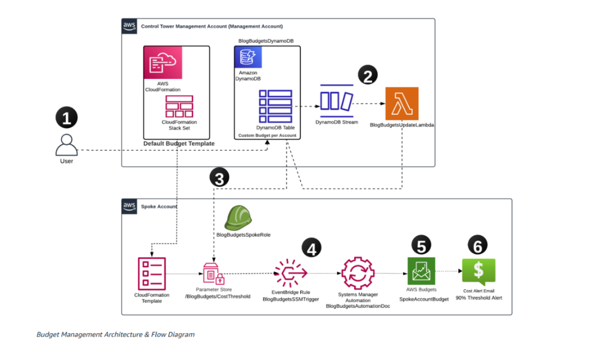
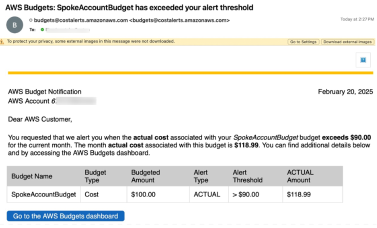

# Automating Budget Management Across Multi-Account Environments

Managing AWS spending across multiple accounts requires a sophisticated approach to budget control and monitoring. Our custom solution enables centralized budget management with automated email notifications, allowing organizations to set and enforce account-specific budgets from a central management account. This automated system tracks spending across individual accounts and sends timely alerts when accounts approach or exceed their allocated budgets. The central management account serves as the single source of truth, where financial teams can configure budget thresholds for each account and receive notifications about spending patterns across the organization's entire account ecosystem.

## Solution Overview

Our solution implements an event-driven architecture to automate budget management across the entire AWS Organization. The process begins at the management account, where individual account budgets are defined and stored in an Amazon DynamoDB table. AWS Lambda functions automatically propagate these budget configurations to each account through their corresponding AWS Systems Manager (SSM) Parameter Store. AWS Budgets monitors spending in real-time, triggering email notifications when accounts approach or exceed allocated thresholds. This streamlined architecture eliminates manual budget management while providing teams with flexibility to operate within defined cost parameters.

## Solution Architecture

### Solution Components

**AWS Control Tower Management Account:**

- DynamoDB Table stores budget information for each linked account.
- Lambda Function triggered by DynamoDB Table updates and proceeds to update budgets in spoke accounts through AWS Systems Manager.

**Linked Account:**

- AWS SSM parameter store holds the updated budget values.
- Amazon CloudWatch events trigger automated processes when parameters (AWS SSM parameter) are updated.
- AWS Budgets manages account costs based on these parameters.
- AWS Budgets sends email notifications if budget thresholds are exceeded.

### Workflow:

1. **Upgrade DynamoDB table**: Users update budget values for a linked account in the DynamoDB table (BlogBudgetsDynamoDB) located in the management account section.

2. **DynamoDB Stream Trigger**: This update triggers a DynamoDB Stream, which in turn triggers Lambda function (BlogBudgetsUpdateLambda) in the management account section.

3. **Lambda function updates AWS SSM Parameter**: Lambda function reads the updated budget value from the DynamoDB table, assumes the cross-account role (BlogBudgetsSpokeRole), and updates SSM Parameter Store (/BlogBudgets/CostThreshold) in the spoke account with the new budget value.

4. **Amazon EventBridge rule triggers event**: When SSM Parameter Store in the spoke account is updated, an EventBridge Rule (BlogBudgetsSSMTrigger) triggers AWS SSM Automation document (BlogBudgetsAutomationDoc) in the spoke account.

5. **Upgrade Budgets**: The AWS SSM Automation document in the spoke account reads the new budget value from SSM Parameter Store and updates the Budgets value (SpokeAccountBudget) accordingly.

6. **Email Notification**: When spending reaches configured thresholds, the system sends notifications to designated stakeholders.

## Operating the Solution

Based on service behavior, when you update the budget value for an account, the budget limit in AWS Budgets will be updated accordingly. However, there are some important points to note regarding alerts:

- Even if you update the budget value after an alert has been triggered, the alert status remains in the "Exceeded" state (or whatever state it was in when triggered). The alert will not automatically reset just because you changed the budget limit.
- It may take up to 8 hours for the new budget status to be reflected in the alert system, meaning changes to the budget will not immediately update the alert status.

### Illustrative Example:

Suppose you set a monthly budget of $100, with an alert triggered at 100% of actual spending.

- During the month, you overspend and reach $200.
- The alert will be triggered, and you'll receive a notification that the budget has been exceeded.
- Even if you increase the budget limit to $250 (to reflect additional costs), the alert will still remain in "Exceeded" status until the end of the month.

This occurs because the alert status is determined based on actual spending and the initial budget limit at the time the alert was triggered, not the updated limit. This behavior ensures you remain aware of all budget overruns while preventing automatic alert resets that could cause you to miss important spending patterns.

## Prerequisites

### AWS Account Setup

- AWS Organizations or AWS Control Tower with multi-account structure
- One management account
- At least one spoke account

### Required AWS Services Access

- AWS Budgets
- AWS Lambda
- Amazon DynamoDB
- AWS Systems Manager (SSM)
- Amazon CloudWatch
- AWS CloudFormation

### Access Permission Requirements

Ensure you have the following minimum necessary permissions in your AWS accounts:

**Management Account:**

- AWS CloudFormation deployment permissions
- DynamoDB table management access
- Lambda function and CloudWatch logs monitoring permissions
- Cross-account AWS Identity and Access Management (IAM) roles management permissions

**Spoke Accounts:**

- AWS CloudFormation deployment permissions
- Read-only access to monitor EventBridge rules, Systems Manager parameters and automation processes, and AWS Budgets
- Email address to receive budget notifications

Detailed deployment steps will be presented in subsequent sections of this article.

## Deploying the Solution

### 1. Deploy Stack for Management Account

In the management account, deploy CloudFormation Stack named 'budget_mgmt_account.yaml', click here to download this template.

This template will deploy:

- DynamoDB table used to store budget values for each spoke account.
- Lambda function triggered by DynamoDB stream to update SSM Parameter Store (specifically, /BlogBudgets/CostThreshold) in each spoke account with new budget values.
- AWS IAM roles with necessary permissions for Lambda function, including cross-account access.

### 2. Deploy Stack for Spoke Accounts

You can set up the spoke account stack using one of the following methods:

**Method 1**: Deploy AWS CloudFormation Stack named 'budget_spoke_account.yaml' directly in each corresponding spoke account.

**Method 2**: Use AWS CloudFormation StackSets from the management account to automatically deploy this template to multiple spoke accounts simultaneously. This approach is suitable if you're managing multiple spoke accounts and want to simplify the deployment process.

### 3. Update DynamoDB Table

After deployment is complete:

1. Access the management account.
2. Navigate to the DynamoDB table named 'BlogBudgetsDynamoDB'.
3. For each spoke account, add a new item:
   - 'AccountId': Enter the 12-digit spoke account ID, example: 111122223333.
   - 'BudgetValue': Enter the desired budget value (numeric), example: 1000.

When the DynamoDB table is updated with account information and budget values, the Lambda function named 'BlogBudgetsUpdateLambda' will be automatically triggered through the DynamoDB stream to update the new budget value into each spoke account's SSM Parameter Store.

### 4. Update SSM Parameter Store

After assuming the cross-account role, the Lambda function will update SSM Parameter Store in the spoke account with the new budget value (example: /BlogBudgets/CostThreshold).

This step ensures budget information is synchronized to the spoke account and ready for subsequent actions.

### 5. Trigger Amazon EventBridge Rule

The updated value in SSM Parameter Store will trigger an Amazon CloudWatch/EventBridge rule. This rule monitors changes in the AWS SSM parameter and generates an event each time the /BlogBudgets/CostThreshold parameter is updated.

### 6. Trigger SSM Automation Process

The CloudWatch event will automatically trigger execution of the SSM Automation document in the spoke account. This document will perform the action of updating the Budgets value based on the new budget parameter value stored in SSM Parameter Store.

### 7. Update Budget

The AWS SSM Automation document will update the Budgets configuration in the spoke account. This step ensures the new budget value is set in Budgets, enabling the system to accurately track and monitor costs according to the updated budget.

### 8. Email Alert Notification

When the budget value has been updated in Budgets, the system will check pre-configured alert thresholds. If current spending exceeds this threshold, an email alert will be automatically triggered. This email will notify designated recipients about the budget overrun, helping ensure timely action can be taken to control costs.

## Resource Cleanup

To avoid future costs, you should delete resources deployed for solution testing purposes by deleting the AWS CloudFormation Stacks deployed in your environment.

## Future Improvements

### Trigger Remediation Actions

To further enhance AWS cost control capabilities, you can implement automated remediation actions using AWS Budget Actions. This feature allows automatic triggering of cost-adjustment responses when budget thresholds are exceeded. A Budget Action is a feature in AWS Budgets that lets you define automatic cost-saving responses whenever budget alerts are triggered. This ensures responses are executed without manual intervention, while promoting a cost-saving culture in the organization.

You can attach remediation actions to budget alerts, configured to trigger when the budget exceeds a certain threshold — whether actual or predicted spending. This is especially useful in preventing unintentional overspending.

**Examples:**

- **IAM Policy**: You can apply the "Deny EC2 Run Instances" IAM policy to users, groups, or roles when the EC2 budget is exceeded.
- **Target specific instances**: You can define actions to stop EC2 instances in a specific region when the EC2 usage budget is violated.

This feature helps organizations automate cost-optimization responses based on defined budget thresholds, helping maintain alignment with financial objectives.

### Integration with ServiceNow for ITSM Process Automation

Another future improvement direction is integrating this solution with ServiceNow to seamlessly automate IT Service Management (ITSM) processes. By combining AWS Budgets and remediation actions with ServiceNow, organizations can automatically create tickets or incidents when a budget threshold is exceeded. These incidents can then trigger predefined automation processes in ServiceNow, such as notifying relevant teams or initiating cost optimization processes.

**Examples:**

- When budget alerts exceed a certain threshold, an incident will be automatically created in ServiceNow to notify the finance or cloud operations team.
- ServiceNow can automatically escalate the issue to higher-level teams, or initiate remediation actions such as requesting approval to scale down resources or perform cost assessment.

This integration helps enhance information flow between finance and operations teams, automates the ticketing process, and ensures budget overrun issues are handled promptly and effectively.

## Conclusion

This solution provides an automated and scalable method for managing budgets across multiple AWS accounts, leveraging services such as Amazon DynamoDB, AWS Systems Manager Parameter Store, AWS Lambda, and AWS Budgets. The solution helps organizations monitor costs effectively and receive timely notifications when budgets exceed allowed limits.

Future enhancements, such as integrating AWS Budget Actions for automated remediation and linking with ServiceNow for ITSM process automation, will strengthen cost management capabilities while improving response speed when budget violations occur. By deploying this solution, organizations can better control AWS costs, maintain spending within budget parameters, and optimize cloud resource utilization efficiency.

The solution is currently available at [AWS-SAMPLES-REPO](https://github.com/aws-samples/sample-event-driven-budget-management-on-aws)

**TAGS:** AWS Budget, CFM

---

## Authors

### Gautam Bhaghavatula

As Senior Partner Solutions Architect at AWS, Gautam Bhaghavatula leverages deep expertise in cloud infrastructure architecture to design highly scalable solutions and implement robust security measures. His expertise includes systems, networking, microservices, and DevOps, applying AWS's most advanced technologies. Currently, he collaborates with AWS partners to drive cloud migration and modernization projects through strategic direction and deep technical leadership.

### Matt Saeger

Senior Deployment Consultant at Amazon Web Services (AWS), leading strategic cloud computing initiatives and orchestrating enterprise-scale transformation programs for customers in the financial services sector. Holding 11 AWS certifications, Matt combines deep expertise in cloud architecture, DevOps, and network architecture with experience leading complex cloud deployment programs. He specializes in building enterprise-level cloud strategies, designing secure and highly scalable solutions, and developing automation solutions with a focus on security and compliance. Contact Matt to discuss cloud transformation strategies, cloud applications in finance, and security best practices in cloud environments.
