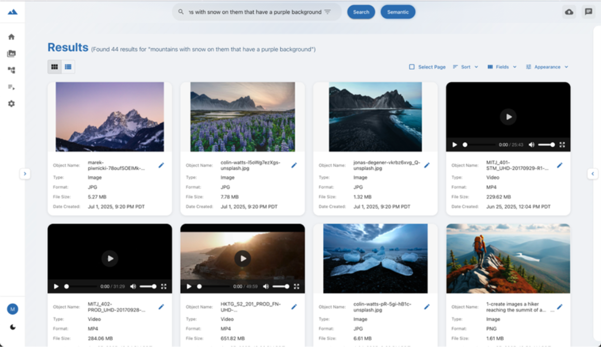

# Introducing: Guidance for a media lake on AWS

Many businesses currently struggle with managing large volumes of digital media files scattered across multiple Amazon Simple Storage Service (Amazon S3) buckets. This distributed storage approach creates serious challenges. Finding specific content can be extremely difficult and time-consuming, while organizing files efficiently becomes a complex task, making it challenging to extract full value from existing content.

Media teams often have to manually search through multiple storage locations, relying solely on filenames to identify content. This inefficient process slows down production workflows and hinders the ability to reuse media assets effectively.

Our guidance for building a Media Lake on Amazon Web Services (AWS) shows you how to create a centralized system for searching and managing media assets stored on AWS. This solution provides a user-friendly interface and convenient APIs for finding and managing media files, while allowing you to create a unified catalog for all media assets — even when they're stored across multiple S3 buckets. Importantly, you can achieve this organization without changing your existing storage structure. Our guidance uses automated processes to catalog and process media files, helping accelerate content discovery and utilization more effectively.

We'll guide you through how a media lake can help you extract more value from digital content by creating a scalable and searchable media storage system that works seamlessly with AWS services and partner solutions. We'll explain the system design, introduce different ways to set it up, and show how to turn your scattered media files into an organized and easily searchable collection.

## Overview

Our guidance for media lake on AWS provides a reference architecture and sample source code that you can deploy to create a media management system. This solution illustrates how to:

- Create a unified search interface, allowing you to search media files across all Amazon S3 storage locations simultaneously.
- Build automated event-driven media processing workflows using default and custom pipelines in a drag-and-drop interface.
- Enable natural language search capabilities through AI-powered integrations.
- Organize your media files by quickly searching, previewing content, and viewing technical information as well as their descriptions and details.

## Deployment

Media lake uses AWS Cloud Development Kit (AWS CDK) for Infrastructure as Code (IaC) model. You can set up the sample code using one of three methods:

### 1. AWS CloudFormation Template

Use the provided CloudFormation template to automatically create AWS CodePipeline. This pipeline will use AWS CodeBuild to deploy the AWS CDK application in your chosen AWS account and region.

### 2. Local Environment Deployment

Deploy media lake directly from your computer using standard AWS CDK deployment methods. This option provides more flexibility, allowing you to change deployment configuration and select AWS profiles before deploying to different AWS Regions as needed.

### 3. Continuous Integration and Deployment (CI/CD) Pipeline

If you already have an existing CI/CD pipeline used to deploy AWS CDK code, you can integrate media lake into that pipeline, allowing you to deploy media lake through your organization's existing CI/CD pipeline.

Regardless of which method you choose, all three approaches set up the same set of AWS resources. This flexibility helps you choose the deployment method that best suits your organization's current workflow and needs.

## Architecture Overview

This system provides a user interface and RESTful API built on serverless architecture to ensure scalability and security. Amazon CloudFront distributes static user interface content stored in Amazon S3, enabling fast and reliable global access, while AWS WAF protects the system from common web vulnerabilities and attacks. Amazon API Gateway handles requests, while Amazon Cognito manages user authentication and generates security tokens to access API resources.

Media lake stores backend data in Amazon DynamoDB and Amazon OpenSearch Service. Media files, logs, and infrastructure code are stored in Amazon S3. The system manages its workflows using AWS Step Functions, which orchestrates the entire process, while AWS Lambda functions handle the actual work of accessing and managing data in storage systems.

To orchestrate media workflow processes used to interact with backend data stores and storage, see the reference architecture for media lake.

## Getting Started

When you deploy our system, it automatically creates an administrator account. An invitation email will be sent to the address you provided during the setup process. When logging in for the first time, you'll need to make an important decision about how you want to search your media assets.

You have two main options:

### Traditional Metadata Search

This method relies on AI-generated keywords, technical metadata, or files to find media assets. This approach is similar to traditional file search systems.

### Semantic Search

This advanced feature allows you to use natural language queries to search media. For example, you can type "find photos of red racing cars" or "show me videos of beaches at sunset". This method goes far beyond simple keyword matching — it understands the meaning behind your query.

It's important to decide on the search method and configure settings before you start importing media into the media lake. This ensures all media assets are properly indexed from the start, speeding up searches later.

If you enable semantic search, traditional metadata search remains available, and you can flexibly switch between the two methods. Figure 1 shows an example of semantic search, displaying the query: "mountains with snow on them and a purple background".

Currently, to enable semantic search, our guidance system uses TwelveLabs' Marengo embedding model for AI-powered video understanding capabilities, combined with OpenSearch Service acting as the vector database. Choose TwelveLabs API as the embedding provider and OpenSearch Service as the embedding storage. Next, configure TwelveLabs integration and import TwelveLabs' pre-configured audio, image, and video pipelines. After completing configuration, these pipelines will automatically create embeddings for all supported media loaded, thereby enabling semantic search functionality.

## Storage Connectors

This guidance system uses storage connectors to link your existing S3 buckets with the system. These connectors serve two important purposes: First, they automatically process any new media files added to your S3 buckets; Second, they sync existing media files in S3 buckets with your media lake. This creates a unified interface displaying all your media files from multiple storage locations.

When you add a storage connector, the guidance system begins a sequence of steps to integrate your content:

1. Activates Amazon EventBridge notifications on the target S3 bucket, if not already enabled.
2. Creates an EventBridge rule to forward Amazon S3 events to Amazon Simple Queue Service (Amazon SQS) queue to ensure stable event processing.
3. When deployed, the system stores the Amazon S3 ingest Lambda function in the IaC S3 bucket. This Lambda function processes queued events to automatically index new media assets.
4. After the Lambda function processes a media asset, an event is sent to the media lake analysis event bus to perform additional analysis and transformations for that media asset.

Our guidance currently requires storage connectors to be in the same AWS Region and account as the media lake. After you add supported new media to the S3 bucket after creating the storage connector, the system will automatically detect, index, and enable searching of these media files.

## Media Lake Integrations

Media lake integrations provide secure credential management capabilities used by pipelines to access external services in your media workflows. By separating credentials from pipeline configuration, you can rotate API keys and manage access independently without editing workflows. This approach allows you to update credentials in one place, and that change automatically applies to all pipelines using those credentials. You can use the media lake interface to create, edit, and update integrations for external services.

This guidance system uses AWS Secrets Manager to securely store all credentials. When you create a pipeline, the system stores necessary credentials as environment variables through Secrets Manager ARNs (Amazon Resource Names). During pipeline execution, each step requiring access to an external service retrieves the corresponding credentials from Secrets Manager using the stored ARN. This approach provides two main benefits: compliance with AWS security best practices in managing third-party API keys and providing centralized control over all credentials in your media workflows. This method helps manage credentials securely and efficiently throughout the media processing workflow.

## Media Lake Pipelines

This guidance system helps optimize creating media workflows on AWS through the pipeline feature. During deployment, the system reads configuration files from its repository to identify nodes to be created and set up. These nodes then display in the drag-and-drop interface, allowing you to visually design your workflow.

Once you've arranged the workflow and saved the pipeline, the system converts your design into an AWS Step Functions state machine. This state machine orchestrates the media workflow according to the specific configuration you defined.

To manage workflow execution, the system sets up three additional components: an Amazon EventBridge rule, an Amazon SQS queue, and an AWS Lambda function. The EventBridge rule is responsible for sending events to the SQS queue, while the Lambda function processes these events from the queue and triggers the corresponding Step Function, starting your media workflow.

This mechanism provides a user-friendly approach to building complex media processing workflows while leveraging the power of AWS services behind the scenes.

When deployed, the system automatically deploys three default pipelines: Default Video Pipeline, Default Audio Pipeline, and Default Image Pipeline. These pipelines are responsible for creating copies, thumbnails, and extracting technical metadata from media assets processed by the storage connectors process. When supported new media files are uploaded to connected S3 buckets, default pipelines automatically begin processing them, ensuring all your media assets are processed consistently. The figure below illustrates the default video code in the drag-and-drop interface.

Media lake supports importing pre-configured pipeline templates; the source code repository includes sample templates illustrating common media processing patterns. When importing pipeline templates, the system requires you to map necessary integrations while maintaining secure credential management across all your workflows.

This guidance system collects media asset metadata during pipeline execution to help you better understand and work more effectively with media assets. This metadata is stored via two complementary AWS services: Amazon DynamoDB serves as the primary metadata repository, while Amazon OpenSearch Service provides full-text search capabilities. When pipelines process media assets, technical metadata is extracted — including resolution, bit depth, sample rate, codec information, bitrate, and duration. Media lake automatically stores this data in DynamoDB and indexes it in OpenSearch Service.

For audio and video content, AI-powered transcription services generate time-aligned text segments, making spoken content searchable and accessible. You can also configure and add additional metadata fields for your organization to track, view, and use. This dual storage approach enables lightning-fast searches, clear understanding of asset quality and technical specifications, access to AI-generated insights, and file extraction in formats suitable for downstream workflows.

After users search for assets, they can navigate to the asset detail screen to view their media assets. For audio and video assets, the system architecture uses Omakase Player, an open-source web player designed for media supply chain use cases. Omakase Player provides a frame-accurate viewing experience and allows displaying time-correlated metadata with the proxy.

When a user selects an asset, the guidance system generates a secure, time-limited Amazon S3 pre-signed URL, allowing access to the proxy stored in Amazon S3. These pre-signed URLs allow streaming content directly from Amazon S3 and automatically expire after a defined period, ensuring convenient access while maintaining security.

The asset detail page provides a detailed interface for your media assets, combining preview, download options, and detailed metadata. You can quickly view the media proxy for playback while retaining access to both original files and proxy versions serving different workflow requirements.

## Conclusion

The guidance system for media lake on AWS illustrates how to build a media management solution on AWS, helping consolidate assets from multiple S3 buckets into a searchable catalog while creating media workflows. This system uses serverless services such as Amazon CloudFront, Amazon API Gateway, AWS Lambda, and Amazon DynamoDB to build a scalable media repository.

Key capabilities include creating visual media workflows (called pipelines), using AWS Step Functions for automated media processing, and using AWS Secrets Manager to manage credentials securely in third-party integrations. Users can search content in two ways: through traditional metadata search, or AI-powered semantic search capable of understanding the meaning behind search phrases. This guidance helps you maintain current storage on Amazon S3 while combining centralized discovery capabilities, workflow automation, and professional media playback through frame-accurate proxy streaming.

By deploying Guidance for a media lake on AWS patterns, you can transform disparate media repositories into an intelligent system capable of processing, indexing, and displaying content through a single interface. Your teams will be able to efficiently search and use media assets across the entire organization, regardless of storage location.

Contact AWS Representative for more details on how we can help accelerate your business.

## Further Reading

- NAB SHOW 2025 Demo Presentation – Enhancing Podcast Content
- AWS for Media & Entertainment
- Guidance on Event-Driven Media Workflow Automation on AWS

---

## Author

### Robert Raver

Robert Raver is Sr. Solutions Architect for media and entertainment at AWS, leading Media Supply Chain initiatives. He designs innovative cloud architectures to optimize media workflows, addressing industry challenges related to media processing, rights, titles, QC, and metadata management. Robert has over 20 years of experience in roles related to Media & Entertainment and Finance industries, including leadership, architecture, and engineering.
